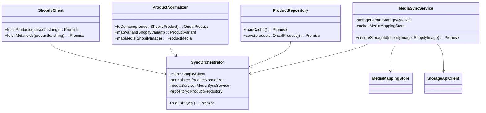

## Shopify Product Sync Specification

### 1. Goal & Scope
- Mirror Shopify product catalog (products, variants, media, inventory, metafields) into Oneal Product Finder data store.
- Scheduled daily full refresh; future-proof for webhook/delta sync.
- Media assets mirrored into Storage API to obtain `storage_id` for canvas/product dialogs.

### 2. Functional Requirements
1. **Initial Sync:** Fetch entire catalog via Shopify Admin GraphQL API; write normalized JSON (`app/data/products.json`) or DB.
2. **Daily Refresh:** Automated job triggers full sync; maintains `updated_at` to detect upstream changes.
3. **Media Pipeline:** Download Shopify images, upload to Storage API, cache mapping `shopify_image_id → storage_id`.
4. **Schema Mapping:** Normalize to existing `OnealProduct` schema (taxonomy, sport, price, variants, media, ai_tags).
5. **Observability:** Log sync stats (counts, duration, failures); raise alert when run fails.
6. **Extensibility:** Provide hooks for future webhooks/delta sync and partial updates.

### 3. Non-Functional Constraints
- Respect Shopify rate limits (GraphQL cost budget 1 000 pts/s, REST 40 req/min).
- Sync job must be idempotent; partial failures should not corrupt current dataset.
- Secrets (Shopify token, Storage API key) managed via `.env` or secret manager.
- Code in TypeScript (preferred) or Python; run inside repo scripts.

### 4. Architecture Overview
```
Shopify Admin GraphQL → Sync Job (Node/TS) → Normalizer → Product Cache (JSON/DB)
                                            ↘ Media Downloader → Storage API → storage_id map
```

- **Sync Job** orchestrates pagination, batching, rate-limit handling.
- **Normalizer** maps Shopify objects to internal schema.
- **Media Service** ensures each image has `storage_id`.
- **Scheduler** (GitHub Action/Cron) runs job daily; optional manual trigger.

### 5. Data Model Mapping
- `ShopifyProduct` → `OnealProduct`
  - `id`, `handle`, `title`, `body_html`, `vendor`, `product_type`
  - `variants` (SKU, option1/2/3, price, inventory_quantity, barcode)
  - `images` / `featured_media`
  - `metafields` (sport, taxonomy)
- Derived fields:
  - `derived_taxonomy` from metafields/category tags.
  - `sport` from metafield or collection.
  - `media[].storage_id` via Storage API upload.
  - `price` & `price_text` from default variant.

### 6. UML Class Diagram


### 7. Implementation Plan
1. **Week 1 – Foundations**
   - Create `shopify` config (tokens, store URL, API version).
   - Implement `ShopifyClient` (GraphQL fetch with cursor pagination, cost-aware throttling).
   - Define TypeScript interfaces for Shopify responses & domain models.

2. **Week 2 – Normalization & Storage**
   - Build `ProductNormalizer` (mapping + taxonomy resolution).
   - Implement `MediaSyncService` with Storage API upload + local cache file (`media-cache.json`).
   - Write `ProductRepository` to persist normalized JSON.

3. **Week 3 – Orchestration & Scheduling**
   - `SyncOrchestrator.runFullSync()` handles pagination, normalization, media sync, final save.
   - Add CLI entry (`npm run sync:shopify`) plus GitHub Action / cron (daily).
   - Logging + metrics (counts, duration, errors). Slack/Webhook alert on failure.

4. **Week 4 – Hardening**
   - Retry & backoff for Shopify/Storage API errors.
   - Optional: write summary manifest (timestamp, product count) for monitoring.
   - Documentation (`docs/shopify-sync-spec.md`), runbook, manual trigger instructions.

### 8. Runbook / Operations
- **Manual Sync:** `npm run sync:shopify` (requires env vars / `.env.local-shopify`).
- **Scheduled Sync:** GitHub Action `.github/workflows/shopify-sync.yml` runs daily at 04:00 UTC.
- **Secrets:** `SHOPIFY_STORE_DOMAIN`, `SHOPIFY_ADMIN_ACCESS_TOKEN`, optional `SHOPIFY_API_VERSION`, `STORAGE_API_*`.
- **Custom Output:** set `SHOPIFY_OUTPUT_PATH=/path/to/products.json` to write to an alternative file (useful for sandbox testing).
- **Logs:** Scripts emit `[ShopifySync ...]` log lines; GitHub Actions retain logs per run.
- **Outputs:** Normalized data at `oneal-api/app/data/products.json`, media cache at `scripts/shopify/.media-cache.json`.
- **Failure Handling:** GitHub Action fails + sends notification (once Slack alert hooked up). For local runs, non-zero exit code.
- **Rollback:** `.bak` copy created each run in same directory—restore manually if necessary.

### 9. Future Enhancements
- Webhook ingestion for near-real-time updates (products/update, inventory_levels/update).
- Incremental delta sync (filter by `updated_at_min`).
- Persist to Postgres for advanced querying, diffing.
- Automated media deduplication via hash.


